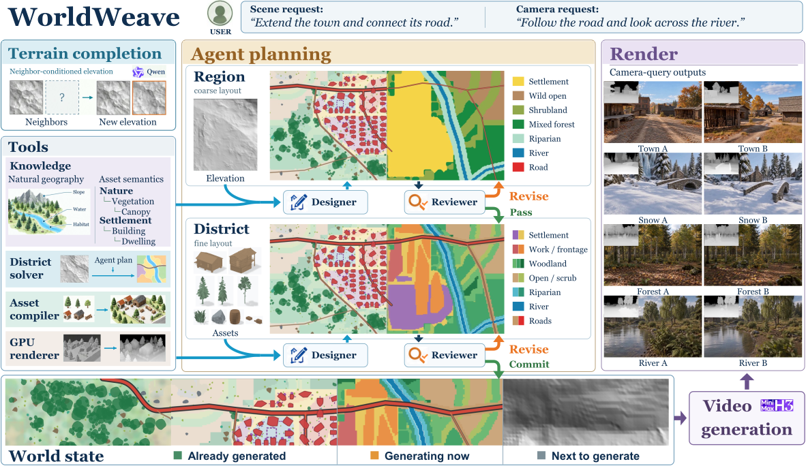
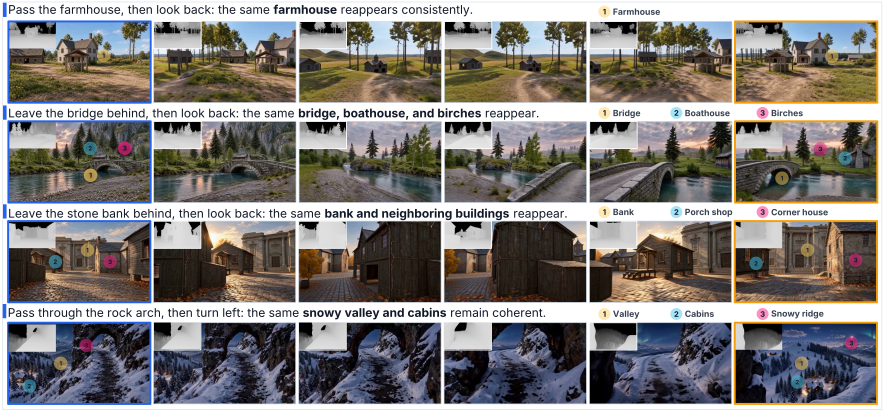

# WorldWeave: Growing Persistent Geometric Worlds for Video Generation

Yifan Huang¹, Lifan Jiang¹, Qingyue Hao¹, Cheng Chen¹, Boxi Wu², Xiaoxue Ren¹, Xiaofei He¹, Dehai Zhao¹†

¹ Zhejiang University · ² Daerwen AI

† Corresponding author.

[Paper](https://arxiv.org/abs/2609.34221) · [Project page](https://laiyindagm.github.io/WorldWeave/) · [arXiv](https://arxiv.org/abs/2609.34221)

**Code coming soon.** This repository currently hosts paper figures, quantitative results and the project page. The implementation and model release will follow.

## Overview

Despite rapid progress, world models still lack explicit, persistent structural memory, making it difficult to preserve consistent world structure during continual scene expansion and cross-view revisits. To address this limitation, we present WorldWeave, a world generation framework that decouples world-state maintenance from visual rendering. Specifically, WorldWeave combines continual elevation-map generation with agent-guided scene organization and stitching to build an expandable explicit 3D world that incrementally extends structural memory while preserving existing structure. First, its terrain module uses diffusion-based image outpainting to generate continuous metric elevation maps under neighborhood conditioning and boundary constraints. Next, an agent integrates user intent, terrain evidence, and cross-region connectivity constraints to construct scenes through hierarchical semantic planning, deterministic geometry compilation, and local revision. Finally, during visual generation, planned camera trajectories query world geometry through a read-only interface, producing depth sequences that guide video synthesis without writing the generated results back into the world state. As a result, structural memory remains independent of short-window video generation, enabling continual expansion without predefined map boundaries and providing a consistent geometric basis for observations across trajectories and repeated visits.

## Video-generation examples

Each row follows one viewing trajectory. Insets show depth guidance; numbered markers identify corresponding scene elements across views.

## Quantitative results

| Method | Imaging quality ↑ | Aesthetic quality ↑ | Structural memory ↑ | Camera compliance ↑ | MN-MS ↑ | MC-GeCo ↓ | MC-MEt3R ↓ | MC-GeoCon ↓ |
| --- | :---: | :---: | :---: | :---: | :---: | :---: | :---: | :---: |
| SANA-WM | 0.739 | 0.619 | 0.328 | 55.5 | 0.973 | 0.113 | 0.203 | 0.189 |
| Zing | 0.763 | 0.685 | 0.989 | 55.8 | 0.974 | 0.0698 | 0.129 | 0.142 |
| SolarWM-5B | 0.755 | 0.604 | 0.370 | 54.7 | 0.956 | 0.0786 | 0.166 | 0.217 |
| AlayaWorld | 0.784 | 0.641 | 1.51 | 56.4 | 0.896 | 0.926 | 0.239 | 0.295 |
| EVOKE-Turbo | 0.784 | 0.718 | 1.12 | 61.6 | 0.961 | 0.105 | 0.182 | 0.249 |
| Echo-WM | 0.791 | 0.655 | 2.21 | 63.5 | 0.968 | 0.0604 | 0.135 | 0.135 |
| Seedance 2.0 | 0.717 | 0.617 | 2.14 | 69.8 | 0.980 | 0.101 | 0.170 | 0.307 |
| Wan3.0 | 0.786 | 0.702 | 1.63 | 59.1 | 0.938 | 0.146 | 0.184 | 0.131 |
| Kling 3.0 | 0.739 | 0.588 | 2.09 | 59.3 | 0.978 | 0.0745 | 0.155 | 0.163 |
| MiniMax-H3 (Base) | 0.725 | 0.617 | 0.438 | 50.8 | 0.979 | 0.0633 | 0.140 | 0.178 |
| WorldWeave | 0.781 | 0.704 | 2.30 (+426.7%) | 72.3 (+42.2%) | 0.981 | 0.0573 | 0.122 | 0.121 (-32.2%) |

The first six baselines are open-source world models; the next four are video models. Values match the paper. Arrows indicate the preferred direction; percentages report changes relative to MiniMax-H3 (Base). Evaluation covers 120 video tasks, with SMC on the common 48 applicable tasks.

[Machine-readable table](docs/data/main_results.json) · [CSV](docs/data/main_results.csv)

## Supplementary visual comparisons

[Farmstead](docs/assets/appendix_compare1.pdf) · [Town](docs/assets/appendix_compare2.pdf) · [Woodland](docs/assets/appendix_compare3.pdf)

## Availability

- Paper and visual results: available here.
- Implementation and models: **coming soon**.
- Video demonstrations: [six continuous-exploration clips on the project page](https://laiyindagm.github.io/WorldWeave/#video).
- [Interactive method comparisons](https://laiyindagm.github.io/WorldWeave/#comparison): four first-frame/prompt cases, eleven methods each. Existing 15-second evaluation clips; web encoding preserves their timing. Input conditioning differs by method.

The repository contains no third-party model weights, game assets, or individual user-study records. Third-party materials remain subject to their respective rights.
